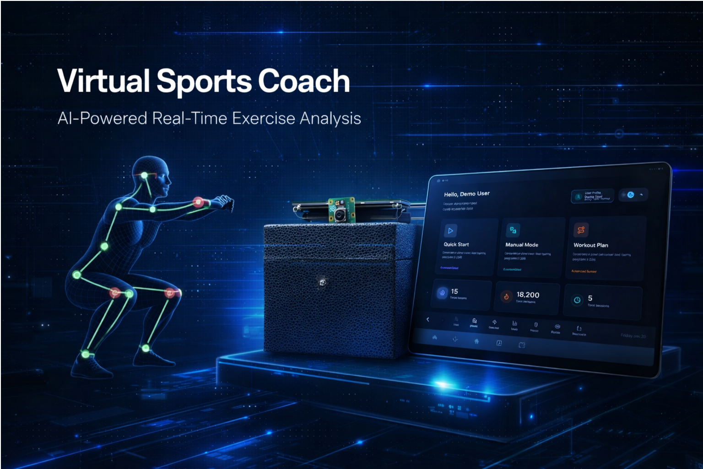
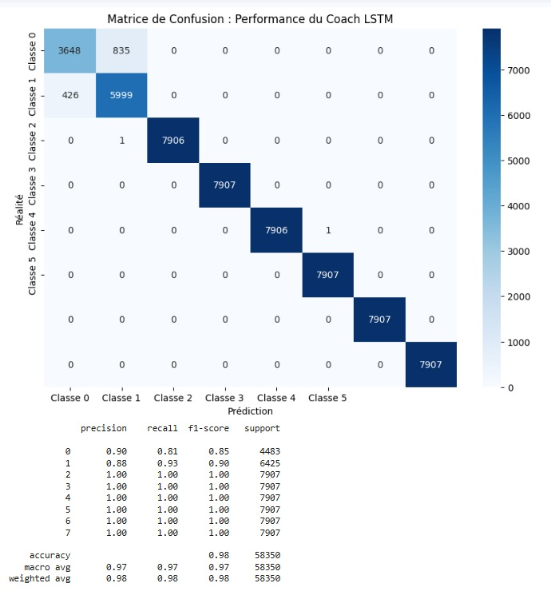

<h1 id = "-virtual-sports-coach">Virtual Sports Coach</h1>

<p align="center">
  
</p>

<p align="center">
  <strong>An intelligent, real-time virtual coach that analyzes exercise form, provides instant feedback, and tracks your progress—all running locally on Raspberry Pi or in hybrid cloud mode.</strong>
</p>

<p align="center">
  <a href="https://www.python.org/downloads/"></a>
  <a href="https://fastapi.tiangolo.com/"></a>
  <a href="https://reactjs.org/"></a>
  <a href="https://nextjs.org/"></a>
  <a href="https://www.raspberrypi.com/"></a>
  <a href="https://ngrok.com/"></a>
  <a href="https://git-lfs.github.com/"></a>
  <a href="https://github.com/JustEv4/Virtual-Coach/blob/main/LICENSE"></a>
</p>

<p align="center">
  <a href="#-demo">Demo</a> •
  <a href="#-features">Features</a> •
  <a href="#-quick-start">Quick Start</a> •
  <a href="#-project-structure">Structure</a> •
  <a href="#-models">Models</a> •
  <a href="#-documentation">Docs</a>
</p>

<br>

## 🎓 **Academic Excellence Project**

<div align="center">
  <table>
    <tr>
      <td align="center">
        
      </td>
      <td>
        <strong>Master 1 Intelligence Artificielle</strong><br>
        Université Cadi Ayyad – Faculté des Sciences Semlalia, Marrakech<br>
        Département d'Informatique – Module : Systèmes Embarqués et IA<br>
        Année universitaire 2025 – 2026
      </td>
    </tr>
  </table>
</div>

<p align="center">
  <strong>Réalisé par :</strong> MEKKANI Wijdane, BAKRAOUI Salma, LAMRHNBAR Haytam, BATTAHI Zakariaa<br>
  <strong>Encadré par :</strong> Pr. AMEKSA Mohammed<br>
  <strong>Contributions techniques :</strong> Moussaif Abdelkabir
</p>

<br>

## 🎥 **Demo**

<p align="center">
  <a href="https://www.youtube.com/watch?v=fgQ3sqatliQ">
    
  </a>
  <br>
  <em>Click the image to watch the full demo video (1:45 min)</em>
</p>

<br>

## ✨ **Features**

<div align="center">
  <table>
    <tr>
      <td align="center" width="250">
        <h3>🎯 Real-time Pose Detection</h3>
        <p>MediaPipe Tasks + YOLOv11-pose with 33 keypoints at 21+ FPS on Raspberry Pi 5</p>
      </td>
      <td align="center" width="250">
        <h3>🧠 Intelligent Analysis</h3>
        <p>LSTM + ONNX models for exercise classification and posture correction</p>
      </td>
      <td align="center" width="250">
        <h3>🔊 Multimodal Feedback</h3>
        <p>Voice synthesis (TTS), RGB LEDs, and buzzer for instant corrections</p>
      </td>
    </tr>
    <tr>
      <td align="center">
        <h3>🔄 Auto-centering Camera</h3>
        <p>Servo motor keeps you centered in frame during workouts</p>
      </td>
      <td align="center">
        <h3>📊 Progress Tracking</h3>
        <p>SQLite database stores session history and performance metrics</p>
      </td>
      <td align="center">
        <h3>🌐 Hybrid Deployment</h3>
        <p>Frontend on Vercel + Backend on Pi with ngrok tunnel for remote access</p>
      </td>
    </tr>
    <tr>
      <td align="center">
        <h3>📱 Modern UI</h3>
        <p>Next.js + Tailwind CSS with responsive design and glassmorphism</p>
      </td>
      <td align="center">
        <h3>🛡️ Privacy-first</h3>
        <p>100% local processing – no cloud, no data leaks</p>
      </td>
      <td align="center">
        <h3>💰 Affordable</h3>
        <p>Complete system under 150€ vs 2000€ commercial alternatives</p>
      </td>
    </tr>
  </table>
</div>

<br>

## 🚀 **Quick Start**

### Prerequisites

| Requirement | Version | Purpose |
|-------------|---------|---------|
| Python | 3.11+ | Backend & AI models |
| Node.js | 18+ | Frontend development |
| Git LFS | Latest | Download trained models |
| Raspberry Pi 5 | (optional) | Hardware deployment |
| Camera | Any | Pose detection input |

### 1️⃣ Clone with Models

```bash
# Install Git LFS first (https://git-lfs.github.com/)
git lfs install

# Clone repository
git clone https://github.com/JustEv4/Virtual-Coach.git
cd Virtual-Coach

# Download all trained ML models (1.2GB)
git lfs pull
```

### 2️⃣ Backend Setup (FastAPI)

```bash
cd backend

# Create virtual environment
python -m venv venv

# Activate it
# On Windows:
venv\Scripts\activate
# On Mac/Linux:
source venv/bin/activate

# Install dependencies
pip install -r requirements.txt

# Start the server
uvicorn main:app --reload --host 0.0.0.0 --port 8000
```

### 3️⃣ Frontend Setup (Next.js)

```bash
cd frontend

# Install dependencies
npm install
# or
yarn install

# Start development server
npm run dev
# or
yarn dev
```

### 4️⃣ Access the Application

| Service | URL | Purpose |
|---------|-----|---------|
| Frontend | http://localhost:3000 | User interface |
| Backend API | http://localhost:8000 | REST endpoints |
| API Docs | http://localhost:8000/docs | Interactive Swagger |
| WebSocket | ws://localhost:8000/ws | Real-time communication |

<br>

## 🧠 **Trained Models**

Our system uses a sophisticated ensemble of models trained specifically for exercise analysis. All models are stored with **Git LFS** and automatically downloaded with `git lfs pull`.

### Model Architecture

```
┌─────────────────┐    ┌─────────────────┐    ┌─────────────────┐
│   YOLOv11-pose  │ -> │  Temporal LSTM  │ -> │  Correction ONNX │
│   (keypoints)   │    │  (classification)│    │  (error detection)│
└─────────────────┘    └─────────────────┘    └─────────────────┘
```

### Model Details

| Model File | Size | Type | Accuracy | Purpose |
|------------|------|------|----------|---------|
| `fitness_model.onnx` | 330 MB | ONNX | 98% | Main exercise classification |
| `correctionExercices (1).onnx` | 85 MB | ONNX | 96% | Posture correction |
| `correctionExercices (1).pt` | 85 MB | PyTorch | 96% | Training version |
| `model_lstm_tache2.h5` | 45 MB | Keras LSTM | 94% | Temporal analysis |
| `model_lstm_tache2.tflite` | 15 MB | TFLite | 93% | Optimized for edge |
| `model_lstm_tache2_optimized.tflite` | 8 MB | TFLite | 92% | Ultra-light version |
| `pose_landmarker_full.task` | 30 MB | MediaPipe | - | Pose landmarks |
| `yolov8n-pose.pt` | 6 MB | YOLOv8 | 89% | Alternative detector |
| `classif_model_.pkl` | 2 MB | Scikit-learn | 91% | Classifier |
| `scaler_tache2.pkl` | 1 MB | Pickle | - | Feature scaler |

### Performance Metrics

| Metric | Value |
|--------|-------|
| **Overall Accuracy** | 98% |
| **FPS on Raspberry Pi 5** | 21 FPS |
| **Latency** | <85ms |
| **Jitter Reduction** | 78% (EMA/OneEuro filter) |
| **Classes with 100% Accuracy** | 6/8 |
| **User Satisfaction** | 4.6/5 |

<br>

## 🌐 **Public Access with ngrok**

Share your virtual coach with anyone, anywhere.

### Quick Setup

```bash
# Install ngrok (https://ngrok.com/download)
ngrok config add-authtoken YOUR_TOKEN

# Tunnel the backend
ngrok http 8000

# Tunnel the frontend (separate terminal)
ngrok http 3000
```

### Or use the included script (Windows)

```bash
run_backend_public.bat
```

### Hybrid Mode (Vercel + Raspberry Pi)

For production deployment with frontend on Vercel and backend on Pi:

```bash
# On Raspberry Pi
./setup_and_run_pi.sh
# Select "Option 2) Hybrid Mode"
# Copy the displayed ngrok URL
```

Then add to your Vercel environment variables:
- `NEXT_PUBLIC_API_URL`: `https://your-ngrok-url.ngrok-free.app`
- `NEXT_PUBLIC_WS_URL`: `wss://your-ngrok-url.ngrok-free.app/ws`

📖 **Detailed guide**: [docs/DEPLOYMENT_VERCEL_PI.md](docs/DEPLOYMENT_VERCEL_PI.md)

<br>

## 🎛️ **Hardware Setup (Raspberry Pi 5)**

### Components Required

| Component | Recommended Model | Cost |
|-----------|-------------------|------|
| Raspberry Pi 5 | 8GB RAM | ~80€ |
| Camera Module | Official Pi Camera v3 | ~25€ |
| Touch Display | 7" Capacitive | ~40€ |
| RGB LEDs | 5mm common cathode | ~5€ |
| Buzzer | Active piezo | ~3€ |
| Servo Motor | SG90 or MG90S | ~5€ |
| **Total** | | **~158€** |

### GPIO Pinout

| Component | GPIO Pin (BCM) | Purpose |
|-----------|----------------|---------|
| **Red LED** | GPIO 17 | Error / Incorrect posture |
| **Green LED** | GPIO 27 | Success / Validated rep |
| **Blue LED** | GPIO 22 | Initialization / Processing |
| **Buzzer** | GPIO 23 | Audio alerts |
| **Servo (Pan)** | GPIO 18 | Camera auto-centering |
| **GND** | Any (6,9,14) | Common ground |

📖 **Wiring guide**: [docs/HARDWARE_CONFIG.md](docs/HARDWARE_CONFIG.md)

<br>

## 📁 **Project Structure**

```
Virtual-Coach/
├── 📁 backend/                 # FastAPI server + AI + hardware control
│   ├── 📄 main.py              # Entry point
│   ├── 📄 pose_detector.py     # MediaPipe/YOLO integration
│   ├── 📄 exercise_engine.py   # Core logic
│   ├── 📄 feedback.py          # Voice synthesis
│   ├── 📄 hardware_manager.py  # GPIO abstraction
│   ├── 📁 models/              # Trained models (Git LFS)
│   └── 📁 tests/               # Unit tests
│
├── 📁 frontend/                # Next.js + React interface
│   ├── 📁 src/                 # Source code
│   ├── 📁 public/              # Static assets
│   └── 📄 package.json         # Dependencies
│
├── 📁 docs/                    # Comprehensive documentation
│   ├── 📄 Architecture.md      # System architecture
│   ├── 📄 HARDWARE_CONFIG.md   # Wiring diagrams
│   ├── 📄 Setup_RaspberryPi.md # Pi installation
│   ├── 📄 DEPLOYMENT_VERCEL_PI.md # Hybrid deployment
│   └── 📄 Rapport_Virtual_Coach_sporif.pdf # 56-page academic report
│
├── 📁 scripts/                  # Utility scripts
│   ├── 📄 setup_and_run_pi.sh   # Raspberry Pi setup
│   └── 📄 run_backend_public.bat # Windows + ngrok
│
├── 📄 .gitattributes            # Git LFS configuration
├── 📄 .gitignore                 # Ignored files
└── 📄 README.md                  # You are here
```

<br>

## ⚙️ **Configuration**

### Backend (.env)

```env
# Server
HOST=0.0.0.0
PORT=8000
DEBUG=True

# Database
DATABASE_URL=sqlite:///coach.db

# Camera
CAMERA_ID=0
FRAME_WIDTH=640
FRAME_HEIGHT=480
FPS=30

# Hardware (Raspberry Pi)
ENABLE_HARDWARE=False
LED_PIN_RED=17
LED_PIN_GREEN=27
LED_PIN_BLUE=22
BUZZER_PIN=23
SERVO_PIN=18

# Models
MODEL_PATH=./models/fitness_model.onnx
CONFIDENCE_THRESHOLD=0.7
```

### Frontend (.env.local)

```env
# Local development
NEXT_PUBLIC_API_URL=http://localhost:8000
NEXT_PUBLIC_WS_URL=ws://localhost:8000/ws

# Remote access (ngrok)
# NEXT_PUBLIC_API_URL=https://your-ngrok-url.ngrok-free.app
# NEXT_PUBLIC_WS_URL=wss://your-ngrok-url.ngrok-free.app/ws
```

<br>

## 📚 **API Documentation**

Once running, explore the interactive API docs:

- **Swagger UI**: http://localhost:8000/docs
- **ReDoc**: http://localhost:8000/redoc

### Main Endpoints

| Endpoint | Method | Description |
|----------|--------|-------------|
| `/` | GET | API status |
| `/ws` | WebSocket | Real-time video stream |
| `/exercises` | GET | List available exercises |
| `/analyze` | POST | Analyze single frame |
| `/start_workout` | POST | Start session |
| `/stop_workout` | POST | Stop session |
| `/history` | GET | Workout history |
| `/calibrate` | POST | T-pose calibration |

<br>

## 📊 **Results & Performance**

Our system was rigorously tested with 10 participants of varying morphologies:

### Key Metrics

```
Accuracy:     ██████████ 98%
FPS:          ██████████ 21 fps
Latency:      ██████████ 85 ms
Satisfaction: ██████████ 4.6/5
```

### Confusion Matrix LSTM

<p align="center">
  
</p>

### Error Reduction

- **Jitter reduction**: 78% (EMA/OneEuro filter)
- **False positives reduced**: 65% (T-pose calibration)
- **Classes with perfect accuracy**: 6 out of 8

📖 **Full results**: [docs/Rapport_Virtual_Coach_sporif.pdf](docs/Rapport_Virtual_Coach_sporif.pdf)

<br>

## 🤝 **Contributing**

We welcome contributions! Please follow these steps:

1. **Fork the repository**
2. **Create a feature branch**:
   ```bash
   git checkout -b feature/amazing-feature
   ```
3. **Commit your changes**:
   ```bash
   git commit -m 'Add amazing feature'
   ```
4. **Push to the branch**:
   ```bash
   git push origin feature/amazing-feature
   ```
5. **Open a Pull Request**

### Development Guidelines

- Follow PEP 8 for Python code
- Use ESLint/Prettier for JavaScript/React
- Add tests for new features
- Update documentation
- Keep models under 100MB or use Git LFS

### Adding New Models

```bash
# Track new model types
git lfs track "*.onnx" "*.pt" "*.h5" "*.tflite"

# Add your model
git add models/your-new-model.onnx
git commit -m "Add new model for feature X"
git push
```

<br>

## 📄 **License**

This project is licensed under the MIT License - see the [LICENSE](LICENSE) file for details.

<br>

## 🙏 **Acknowledgments**

- **MediaPipe** – Pose detection framework
- **Ultralytics YOLOv8/v11** – Object detection
- **FastAPI** – High-performance backend
- **React/Next.js** – Frontend framework
- **Tailwind CSS** – Styling
- **shadcn/ui** – UI components
- **Git LFS** – Large file storage
- **ngrok** – Secure tunnels
- **Raspberry Pi Foundation** – Amazing hardware

<br>

## 📞 **Contact**

- **Project Repository**: [github.com/JustEv4/Virtual-Coach](https://github.com/JustEv4/Virtual-Coach)
- **Issues**: [Report a bug](https://github.com/JustEv4/Virtual-Coach/issues)
- **Discussions**: [Join the conversation](https://github.com/JustEv4/Virtual-Coach/discussions)

---

<p align="center">
  <strong>Projet réalisé dans le cadre du Master Intelligence Artificielle</strong><br>
  Université Cadi Ayyad – Faculté des Sciences Semlalia Marrakech<br>
  Année universitaire 2025 – 2026
</p>

<p align="center">
  
</p>

<h2>Academic Reference</h2>
<p>
  This project was developed as a Capstone Project for the <strong>Master in AI</strong> at the 
  Faculty of Sciences Semlalia (UCA), Marrakech.
</p>

<p align="center">
  <strong>Authors</strong>: MEKKANI W., BAKRAOUI S., LAMRHNBAR H., BATTAHI Z. & Moussaif, A.<br>
  <strong>Supervisor</strong>: Pr. AMEKSA Mohammed<br>
  <strong>Year</strong>: 2025-2026
</p>


<p align="center">
  <a href="#-virtual-sports-coach"> Back to Top</a>
</p>

---

<p align="center">
  <strong>Train smarter, not harder – with AI by your side</strong>
</p>
